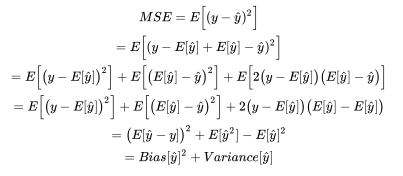
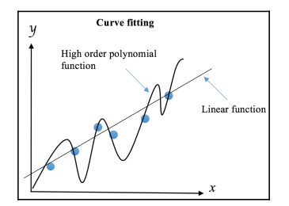
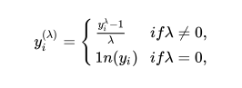

I. Các khái niệm cơ bản về ML:
Phân loại ML:

Các khái niệm:
    -- Overfit (low bias high variance) khi model quá khớp với dữ liệu training
    -- Underfit (high bias low variance) khi model quá sai lệch
    --> Bias-Variance trade-off

MSE (mean squared error) kết hợp cả sai số và phương sai

Giới thiệu các cách để giảm thiểu overfit:

Các hàm đa thức bậc cao sẽ rất phù hợp với dữ liệu train nhưng sẽ dễ gây ra overfit
    

+ Với dữ liệu đủ lớn chia ra 3 subset: train-set, validate-set, test-set

+ Cross-validation: thường dùng khi không có dữ liệu đủ lớn, không thể chia ra nhiều các subset, dùng để giảm thiểu overfit
    Có 2 loại chính:   
    - exhaustive (toàn diện)
    Chia ra n subset (với n là độ lớn dữ liệu), và n lần học. Mỗi lần học thứ i sẽ tách phần tử thứ i làm test-set
    -> Leave-One-Out-Cross-Validation (LOOCV)

    - non-exhaustive (Không toàn diện)
    Tương tự LOOCV nhưng dữ liệu được chia thành K phần lớn hơn (k thường là 3, 5, 10)
    -> K-fold cross-validation

    Cũng có thể random test-set từ training-set
    -> holdout

+ Regularization: thay đổi mô hình hoặc cách chạy để làm giảm overfit

    - Early stoping: ép mô hình chạy trong khoảng thời gian hoặc đặt một số tiêu chí dừng.
    - regularization loss function: Thêm vào hàm mất mát một số hạng nào đó để đánh giá độ phức tạp của mô hình.

+ Lựa chọn thuộc tính (features) và giảm số chiều:

    - với quá nhiều thuộc tính sẽ làm tăng số lần thực hiện tính toán
    - Giảm số chiều có thể sẽ làm mất mát thông tin.

II. Các kỹ thuật tiền xử lý:
+ Chuẩn Cross-Industry Standard Process for Data Mining (CRISP-DM) gồm các bước:
    - Business understanding: Hiểu theo cách chuyên ngành, thường do các chuyên gia làm.
    - Data understanding: Hiểu và thống kê dữ liệu, hiểu theo hướng kỹ thuật. -> Thăm dò (phase exploration)
    - Data preparation: Dữ liệu được chuẩn hóa thành các tập dữ liệu phục vụ khai thác, phân chia thành training và test -> tiền xử lý (preprocessing)
    - Modeling: Mô hình hóa dữ liệu với máy học, tạo ra các model phù hợp với dữ liệu.
    - Evaluation: Đánh giá độ phù hợp của model với dữ liệu.
    - Deployment: Triển khai, tạo ra hệ thống hoạt động dựa trên model.

+ Phần lớn thời gian học máy là để làm sạch và tiền xử lý dữ liệu. Có một số dự án cố gắng tự động việc này nhưng hiện tại chủ yếu vẫn phải làm thủ công.
+ Chuẩn hóa dữ liệu gồm 2 bước:
    - Đọc dữ liệu
    - Trực quan hóa dữ liệu cố gắng mang về dạng số, chú ý về các thuộc tính, đơn vị tính,...
+ Features Engineering là quá trình tạo mới hoặc cải thiện thuộc tính, chuyển đổi tập thô thành tập các thuộc tính (features). chú ý features (thuộc tính nhưng mang nhiều ý nghĩa hơn) và attributes (thuộc tính)

+ Một số xử lý thường dùng:
    - Thiếu dữ liệu: dữ liệu test xuất hiện có giá trị mà chưa từng được train. các cách khắc phục là bỏ qua hoặc gán cho một giá trị cố định (trung bình, trung vị hoặc giá trị xuất hiện nhiều nhất (mode))
    - Với các dữ liệu không phải số: cố gắng chuyển sang dạng số bằng các cách như: label encoding (gắn số tượng trưng cho từng dữ liệu) one-hot-encoding (chuyển sang dạng ma trận các số bằng cách tạo các thuộc tính ẩn, ma trận phần lớn là dữ liệu false (0) gọi là ma trận thưa (sparse matrix))
    - Dữ liệu trong các thuộc tính khác nhau sẽ có thể khác nhau về độ lớn. nên scale dữ liệu nhỏ lại để tiện tính toán. Các phương pháp thường sẽ biến đổi dữ liệu thuộc khoảng [0,1] hoặc [-1, 1]
    - Chúng ta có thể tạo ra thuộc tính mới từ các thuộc tính trước thành thuộc tính đa thức (polynomial features). giả sử có 2 thuộc tính a, b sẽ có thể tạo ra thuộc tính mới như ab - thuộc tính này gọi là tương tác (interaction) của a và b. thường sẽ là tích, có thể dùng tổng, hiệu, thương,... nhưng cẩn thận phép chia với 0.cái này giúp tăng độ chính xác và có xu hướng gây overfit. số lượng thuộc tính trong thuộc tính đa thức là không giới hạn, nhưng nên tránh quá nhiều gây khó khăn trong tính toán.
    - power transform: biến đổi dữ liệu số sang dạng dữ liệu khác thuận tiện hơn trong tính toán gần với phân phối bình thường. thường là dùng hàm logarit hoặc box-cox transformation

    

    - Gom nhóm dữ liệu (binning): đôi khi cần gom các dữ liệu sang các dạng tổng quát hơn. ví dụ khoanh vùng độ tuổi, khu vực... điều này sẽ làm mất mát dữ liệu nhưng chắc chắn sẽ giảm tính toán và tăng tốc quá trình. tùy theo yêu cầu và tính toán của người thực hiện.

+ Trong máy học, cũng cần thiết có sự kết hợp giữa các mô hình (combining model) để tăng độ chính xác theo các phương án sau:
    - voting and averaging: đơn giản là đầu ra sẽ được chọn là trung bình hoặc cái có xác suất cao hơn từ các kết quả dự đoán bởi nhiều mô hình khác nhau.
    - bagging (hoặc bootstrap aggregating): mục tiêu làm giảm overfit bằng các bước:
        - tạo dữ liệu train mới từ data ban đầu bằng cách chọn và thay thế
        - tạo model từ các train set mới tạo
        - chọn ra kế quả tốt nhất với voting and averaging.
    - boosting: Các quá trình học tập sẽ có tính kế thừa từ các lần học trước, tập trung vào các thuộc tính hoặc điểm quan trọng.
    - stacking: đầu ra của thuật toán này có thể làm đầu vào của thuật toán khác để tạo ra nhiều lần học liên tiếp.

III. Chuẩn bị môi trường cần thiết cho các bài thực hành sau:
- Python
- Numpy
- Scipy
- Pandas
- Scikit-learn
- Tensorflow
