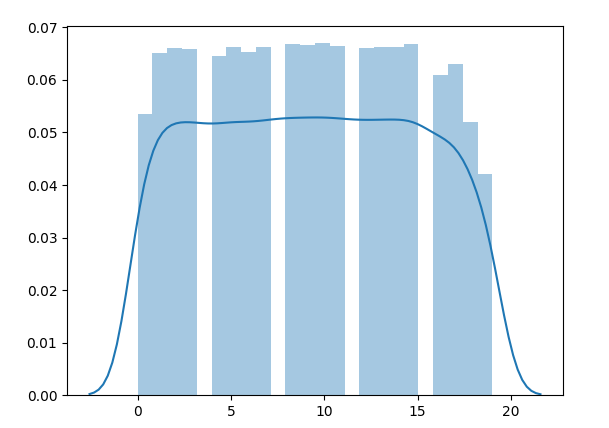

# Text analysis techniques
## Tìm hiểu về xử lý ngôn ngữ tự nhiên - Natural Language Processing

- Máy tính có thể xử lý tốt với các con số nhưng không thể hiểu và làm việc được với các dạng dữ liệu ngôn ngữ, văn bản tự nhiên. Vì vậy, con người cần làm những việc gì đó để giúp máy tính có thể hiểu được dạng dữ liệu này.
- Xử lý ngôn ngữ tự nhiên là một lĩnh vực quan trọng của máy học, liên quan đến sự tương tác của máy tính với dữ liệu ngôn ngữ tự nhiên của con người (gồm nhiều dạng như lời nói, văn bản, ký hiệu, đơn thuốc, bản nhạc,...).
- Các ứng dụng của NLP có thể kể đến như dịch văn bản, đặt nhãn cho hình ảnh, chatbot.

## Tìm hiểu sơ lược các bộ công cụ trong NLP

- Một số thư viện hỗ trợ xử lý ngôn ngữ tự nhiên trong python:
    - nltk:     https://nltk.org
    - spaCy:    https://spacy.io
    - Gensim:   https://radimrehurek.com/gensim
    - TextBlob: https://textblob.​readthedocs.​io/​en/​dev

- Corpus:
    - nltk có sẵn hơn 100 bộ dữ liệu văn bản, từ ngữ dựng sẵn (gọi là tập corpora)
    - các tập dữ liệu này dùng để train hoặc validate dữ liệu học máy.
    - một số bộ dữ liệu quan trọng như twitter samples, shakespeare corpus sample,..
    - để sử dụng cần tải xuống bộ dữ liệu trên nltk.

- Tokenization:
    - là bước chia một câu hoặc văn bản thành danh sách các phần nhỏ hơn như các từ, cụm từ hoặc câu phù hợp, có thể bỏ đi các kí tự dấu chấm, phẩy.
    - unigrams là tách ra danh sách các phần gồm 1 từ, bigrams là chia ra 2 từ, n-grams là chia n từ

    

    - trong nltk có xây dựng sẵn hàm tokenization theo khoảng trống: *word_tokenize()* dữ lại đầy đủ dấu câu, và số chỉ bỏ đi khoảng trắng và ký tự xuống dòng. hoặc phân theo câu *sent_tokenize()*

- PoS tagging:
    - Gẵn nhãn từ loại cho từ.
    - Trong nltk có hỗ trợ hàm dựng sẵn là một kết quả của quá trình học máy với bộ dữ liệu corpus: *pos_tag()* trả về các ký hiệu nhãn từ loại.
    ```
    >>> import nltk
    >>> tokens = word_tokenize(sent)
    >>> print(nltk.pos_tag(tokens))
    [('I', 'PRP'), ('am', 'VBP'), ('reading', 'VBG'), ('a', 'DT'), ('book',
    'NN'), ('.', '.'), ('It', 'PRP'), ('is', 'VBZ'), ('Python', 'NNP'),
    ('Machine', 'NNP'), ('Learning', 'NNP'), ('By', 'IN'), ('Example', 'NNP'),
    (',', ','), ('2nd', 'CD'), ('edition', 'NN'), ('.', '.')]
    ```
    - Ý nghĩa các nhãn xem bằng cách:
    ```
    >>> nltk.help.upenn_tagset('PRP')
    PRP: pronoun, personal
    hers herself him himself hisself it itself me myself one oneself ours
    ourselves ownself self she thee theirs them themselves they thou thy us
    >>> nltk.help.upenn_tagset('VBP')
    VBP: verb, present tense, not 3rd person singular
    predominate wrap resort sue twist spill cure lengthen brush terminate
    appear tend stray glisten obtain comprise detest tease attract emphasize
    mold postpone sever return wag ...
    ```

- Named-entity recognition:
    - Nhận diện các tên riêng như tên người, địa điểm, công ty,... hoặc các từ chỉ thời gian, ngày tháng, tiền tệ,...
    - trong spaCy xây dựng thuộc tính _ents_ như sau:
    ```
    >>> tokens3 = nlp('The book written by Hayden Liu in 2018 was sold at $30 in America')
    >>> print([(token_ent.text, token_ent.label_) for token_ent in tokens3.ents])
    [('Hayden Liu', 'PERSON'), ('2018', 'DATE'), ('30', 'MONEY'), ('America','GPE')]
    ```

- Stemming and lemmatization:
    - Stemming là bước để hoàn nguyên một từ đã được biến đổi thành từ gốc. ví dụ, learning, learned sẽ có từ gốc là learn.
    - lematization là phiên bản nâng cấp của stemming khi nó xét thêm các thuộc tính PoS trong lúc stem.
    - Ví dụ với stemming trong nltk:
    ```
    >>> from nltk.stem.porter import PorterStemmer
    >>> porter_stemmer = PorterStemmer()
    >>> porter_stemmer.stem('machines')
    'machin'
    >>> porter_stemmer.stem('learning')
    'learn'
    ```
    - Ví dụ với lemmatization trong nltk:
    ```
    >>> from nltk.stem import WordNetLemmatizer
    >>> lemmatizer = WordNetLemmatizer()
    >>> lemmatizer.lemmatize('machines')
    'machine'
    >>> lemmatizer.lemmatize('learning')
    'learning' # ở đây learning được coi là danh từ nên sẽ được dữ nguyên từ gốc
    ```

- Semantics and topic modeling:
    - Tìm ra ý nghĩa và khám phá ra chủ đề tiềm ẩn bên trong mỗi văn bản.
    - gesim là thư viện hỗ trợ mạnh mẽ cho việc này với nhiều phương pháp mô hình hóa ngữ nghĩa mạnh mẽ. Bên cạnh đó gesim còn cung cấp nhiều tính năng sau:
        - word embedding (nhúng từ): nhiệm vụ ánh xạ các từ sang vector số.
        - similarity querying (truy vấn tương đồng): tìm ra đối tượng tương tự như đối tượng đầu vào.
        - Distributed computing (tính toán phân tán): giúp quá trình tính toán nhanh từ hàng triệu văn bản

## Giới thiệu bộ dữ liệu 20 nhóm tin

- Tổng quan:
    - Dữ liệu sẽ gồm 20000 văn bản tin tức được phân vào 20 nhóm tin sau:
        + comp.graphics
        + comp.os.ms-windows.misc
        + comp.sys.ibm.pc.hardware
        + comp.sys.mac.hardware
        + comp.windows.x
        + rec.autos
        + rec.motorcycles
        + rec.sport.baseball
        + rec.sport.hockey
        + sci.crypt
        + sci.electronics
        + sci.med
        + sci.space
        + misc.forsale
        + talk.politics.misc
        + talk.politics.guns
        + talk.politics.mideast
        + talk.religion.misc
        + alt.atheism
        + soc.religion.christian
    - Dễ dàng hiểu ra nội dung với tên nhóm tin
    - có một số nhóm tin có nội dung chồng chéo lên nhau như _comp.os.ms-windows.misc, comp.windows.x, comp.graphics_ và cũng có các nhóm có nội dung hoàn toàn không liên quan như _soc.religion.christian, rec.sport.hockey_

- Tải bộ dữ liệu:
```
>>> from sklearn.datasets import fetch_20newsgroups
>>> groups = fetch_20newsgroups()
Downloading 20news dataset. This may take a few minutes.
Downloading dataset from https://ndownloader.figshare.com/files/5975967 (14 MB)
```

- Tìm hiểu bộ dữ liệu:
    _Các câu lệnh cơ bản và hiển thị dữ liệu trong file code/main.py_

    

## Phân tích bộ dữ liệu 20 nhóm tin

- Đếm số lần xuất hiện của tất cả các token:
    + Đây gọi là mô hình bag of words (BoW).
    + Mô hình này sẽ tạo ra một bộ từ điển là tất cả các token xuất hiện trong bộ dữ liệu rồi đếm số lần xuất hiện bên trong mỗi câu.
    + Mô hình này sẽ bỏ qua hoàn toàn nghĩa và thứ tự của các từ trong câu.
    + Có thể mở rộng bằng cách thêm thứ tự và chú ý PoS của từ nhưng sẽ cần nhiều tính toán hơn và việc lập trình cũng nhiều khó khăn hơn.
    + Ví dụ với dữ liệu này, dùng hàm _CountVectorizer_ của _scikit-learn_ để tách từ với dạng unigrams.
    ```
    >>> from sklearn.feature_extraction.text import CountVectorizer
    >>> count_vector = CountVectorizer(max_features=500)
    >>> data_count = count_vector.fit_transform(groups.data)
    ```
    + Với cách làm hiện tại 500 thuộc tính được lấy ra phần lớn là số, một số ký tự lạ như 'a86' hoặc các từ không có nhiều đóng góp nghĩa cho câu (the, then, then,...) và các từ tương đương nhau (tell - told, use - used, time - times)

- Tiền xử lý văn bản:
    + Ở đây, chúng ta sẽ loại bỏ hết tất cả các từ có số, ký tự đặc biệt, dấu câu,... chỉ dữ lại từ có các ký tự chữ cái.

- Loại bỏ stop words:
    + Stop words là những từ phổ biến, ít cung cấp dữ liệu trong các bài toán phân lớp. trong mô hình BoW, các từ này gây thêm nhiễu và tăng yêu cầu tính toán, vì vậy cẩn được loại bỏ.
    + Không có danh sách tổng quát về các stop words, mỗi thư viện thường cung cấp một stop words list.
    + Danh sách stop words trong scikit-learn:
    ```
    >>> from sklearn.feature_extraction import stop_words
    >>> print(stop_words.ENGLISH_STOP_WORDS)
    frozenset({'most', 'three', 'between', 'anyway', 'made', 'mine', 'none',
    'could', 'last', 'whenever', 'cant', 'more', 'where', 'becomes', 'its',
    'this', 'front', 'interest', 'least', 're', 'it', 'every', 'four', 'else',
    'over', 'any', 'very', 'well', 'never', 'keep', 'no', 'anything', 'itself',
    'alone', 'anyhow', 'until', 'therefore', 'only', 'the', 'even', 'so',
    'latterly', 'above', 'hereafter', 'hereby', 'may', 'myself', 'all',
    'those', 'down',
    ......
    ......
    'him', 'somehow', 'or', 'per', 'nowhere', 'fifteen', 'via', 'must',
    'someone', 'from', 'full', 'that', 'beyond', 'still', 'to', 'get',
    'himself', 'however', 'as', 'forty', 'whatever', 'his', 'nothing',
    'though', 'almost', 'become', 'call', 'empty', 'herein', 'than', 'while',
    'bill', 'thru', 'mostly', 'yourself', 'up', 'former', 'each', 'anyone',
    'hundred', 'several', 'others', 'along', 'bottom', 'one', 'five',
    'therein', 'was', 'ever', 'beside', 'everyone'})
    ```
    + Sau khi loại bỏ stop words danh sach các thuộc tính đã đẹp hơn, tuy nhiên, còn có một số thuộc tính là tên riêng như 'micheal'

- Stemming và lemmatizing:
    + Stemming là cách làm đơn giản, nhanh hơn với công việc chủ yếu là cắt bỏ ký tự của từ nên đôi khi các từ được stemming sẽ không đúng. ví dụ _trying và try -> tri_
    + Lemmatizing chậm nhưng chính xác hơn bằng việc tra từ điển các từ tạo ra để đảm bảo tính đúng đắn.
    + Dùng công cụ _WordNetLemmatizer_ của nltk:
    ```
    >>> from nltk.stem import WordNetLemmatizer
    >>> lemmatizer = WordNetLemmatizer()
    ```
    + Ngoài ra nltk có xây dựng sẵn bộ dữ liệu tên riêng _names_
    ```
    >>> from nltk.corpus import names
    >>> all_names = set(names.words())
    ```

## Trực quan hóa dữ liệu với t-SNE
Dữ liệu hiện đã được vector hóa thành các vector 500 chiều. Chúng ta thường có thể cảm nhận dữ liệu với mô hình trực quan 3 chiều vì vậy cần có các phương pháp để giảm số chiều như là t-SNE.
- Giới thiệu dimensionality reduction:
    + Giảm số chiều là một kỹ thuật máy học quan trọng giúp giảm số lượng các thuộc tính đồng thời cố gắng dữ lại nhiều thông tin nhất có thể. nó thường có được bằng cách tạo ra được bộ thuộc tính mới thay thế cho một số bộ thuộc tính cũ.
    + Việc giảm số chiều vừa dễ trực quan hóa vừa tối ưu quá trình tính toán, giảm sự dư thừa.
    + Giảm kích thước không chỉ đơn giản là lấy ra một hoặc 2 cặp thuộc tính, nó chuyển đổi không gian với các thuộc tính ban đầu sang không gian có số chiều nhỏ hơn.
    + Một ví dụ là phương pháp _Principal Component Analysis (PCA)_. Phương pháp này cho rằng dữ liệu thường không phân bố ngẫu nhiên mà sẽ phân bố theo đường hoặc mặt đặc biệt nào đó. PCA cho rằng các đường này là tuyến tính.


    