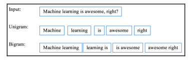

# Text analysis techniques
## Tìm hiểu về xử lý ngôn ngữ tự nhiên - Natural Language Processing

- Máy tính có thể xử lý tốt với các con số nhưng không thể hiểu và làm việc được với các dạng dữ liệu ngôn ngữ, văn bản tự nhiên. Vì vậy, con người cần làm những việc gì đó để giúp máy tính có thể hiểu được dạng dữ liệu này.
- Xử lý ngôn ngữ tự nhiên là một lĩnh vực quan trọng của máy học, liên quan đến sự tương tác của máy tính với dữ liệu ngôn ngữ tự nhiên của con người (gồm nhiều dạng như lời nói, văn bản, ký hiệu, đơn thuốc, bản nhạc,...).
- Các ứng dụng của NLP có thể kể đến như dịch văn bản, đặt nhãn cho hình ảnh, chatbot.

## Tìm hiểu sơ lược các bộ công cụ trong NLP

- Một số thư viện hỗ trợ xử lý ngôn ngữ tự nhiên trong python:
    - nltk:     https://nltk.org
    - spaCy:    https://spacy.io
    - Gensim:   https://radimrehurek.com/gensim
    - TextBlob: https://textblob.​readthedocs.​io/​en/​dev

- Corpus:
    - nltk có sẵn hơn 100 bộ dữ liệu văn bản, từ ngữ dựng sẵn (gọi là tập corpora)
    - các tập dữ liệu này dùng để train hoặc validate dữ liệu học máy.
    - một số bộ dữ liệu quan trọng như twitter samples, shakespeare corpus sample,..
    - để sử dụng cần tải xuống bộ dữ liệu trên nltk.

- Tokenization:
    - là bước chia một câu hoặc văn bản thành danh sách các phần nhỏ hơn như các từ, cụm từ hoặc câu phù hợp, có thể bỏ đi các kí tự dấu chấm, phẩy.
    - unigrams là tách ra danh sách các phần gồm 1 từ, bigrams là chia ra 2 từ, n-grams là chia n từ

    

    - trong nltk có xây dựng sẵn hàm tokenization theo khoảng trống: *word_tokenize()* dữ lại đầy đủ dấu câu, và số chỉ bỏ đi khoảng trắng và ký tự xuống dòng. hoặc phân theo câu *sent_tokenize()*

- PoS tagging:
    - Gẵn nhãn từ loại cho từ.
    - Trong nltk có hỗ trợ hàm dựng sẵn là một kết quả của quá trình học máy với bộ dữ liệu corpus: *pos_tag()* trả về các ký hiệu nhãn từ loại.

        >>> import nltk
        >>> tokens = word_tokenize(sent)
        >>> print(nltk.pos_tag(tokens))
        [('I', 'PRP'), ('am', 'VBP'), ('reading', 'VBG'), ('a', 'DT'), ('book',
        'NN'), ('.', '.'), ('It', 'PRP'), ('is', 'VBZ'), ('Python', 'NNP'),
        ('Machine', 'NNP'), ('Learning', 'NNP'), ('By', 'IN'), ('Example', 'NNP'),
        (',', ','), ('2nd', 'CD'), ('edition', 'NN'), ('.', '.')]

- Named-entity recognition:

- Stemming and lemmatization:

- Semantics and topic modeling:

