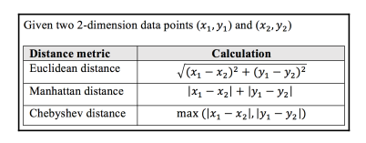

# Khai thác dữ liệu 20 nhóm tin với thuật toán gom cụm và mô hình hóa chủ đề

## Học không giám sát (Unsupervised learning)
- Chương trước đã giới thiệu qua về thuật toán t-SNE là một mô hình học không giám sát.
- Thay vì có một dữ liệu mẫu đã được gán nhãn đầu ra cụ thể, học không giám sách xác định cấu trúc vốn có hoặc đặc điểm chung của dữ liệu đầu vào. Vì thế học không giám sát có khả năng sẽ phân tích ra được những thông tin ẩn sâu bên trong dữ liệu đó.
- Học không giám sát làm việc với bộ dữ liệu không được gán nhãn và gồm các loại sau:
    + Clustering (gom cụm): Nhóm dữ liệu dựa trên sự phổ biến, thường được sử dụng để phân tích dữ liệu thăm dò.Các kỹ thuật phân cụm được sử dụng rộng rãi trong phân loại khách hàng hoặc để nhóm các hành vi mua hàng tương tự nhau.
    + Association: Tìm ra được các thuộc tính cụ thể từ 2 hoặc nhiều thuộc tính. Các bài toán thường gặp như phát hiện phần tử hiếm xuất hiện (outlier detection).
    + Projection: Ánh xạ không gian thuộc tính ban đầu sang không gian có ít chiều hơn. ví dụ như t-SNE trong giảm chiều thuộc tính.
- Học không giám sát được sử dụng rộng rã trong xử lý ngôn ngữ tự nhiên vì khó lấy được dữ liệu có gán nhãn.

## Dữ liệu nhóm tin với thuật toán k-means clustering
### Giới thiệu k-means clustering
- Mục tiêu của thuật toán là phân dữ liệu thành k nhóm (được định trước) dựa trên sự tương đồng về các thuộc tính. mỗi cụm được xác định bởi một centroid (trung tâm của cụm) và các dữ liệu xung quanh cách centroid gần nhất.
- Các bước của thuật toán:
    + 1. Khởi tạo giá trị k: số lượng cluster sẽ được tạo ra.
    + 2. Khởi tạo centroid: thuật toán bắt đầu với việc tạo ra k centroid ngẫu nhiên từ các điểm đầu vào.
    + 3. Phân cụm: Tiến hành tính khoảng cách từng điểm đến các centroid và phân cụm với centroid gần nhất. khoảng cách thường được tính với công thức khoảng cách euclide
    
    + 4. Cập nhật lại giá trị centroid: Với mỗi cluster sẽ tìm ra được centroid mới bằng giá trị trung bình của các điểm trong cluster tương ứng.
    + 5. Lặp lại bước 3 và 4: Lặp lại các bước phần cụm và tính centroid đến khi các centroid thay đổi đủ nhỏ hoặc đạt số lần lặp định trước.
- Đầu ra của thuật toán:
    + Giá trị cluster id của mỗi đầu vào
    + k centroid để sữ dụng cho các lần test. cluster id sẽ là cenctroid gần nhất.

### Hiện thực k-means clustering

### Hiện thực k-means với sklearn

### Cách chọn giá trị k

### 

