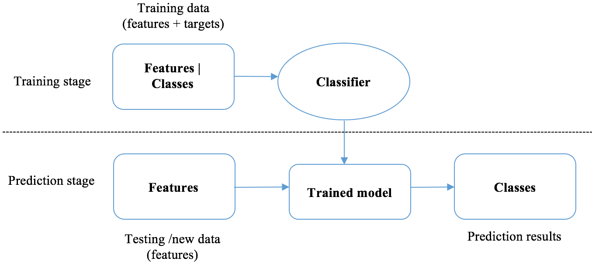

# Bài toán phân loại email với naive bayes

## Bài toán phân lớp
- Classification là một trong những công việc chính của học có giám sát
- Nhiệm vụ của classification là từ bộ dữ liệu ban đầu đã được gán nhãn, tìm ra được một quy tắc ánh xạ các dữ liệu chưa có nhãn vào các nhóm hoặc nhãn thích hợp

## Các bài toán phân lớp
- Binary classification: phân loại dữ liệu vào một trong 2 nhóm. ví dụ lọc email spam có 2 nhãn đầu ra là spam hoặc không phải spam

- Multiclass classification: Cho phép phân loại dữ liệu vào nhiều hơn 2 nhóm. ví dụ nhận dạng số viết tay, phân loại ra 10 nhóm là các số từ 0 - 9

- Multi-label classification: Một dữ liệu có thể đươc gắn nhiều nhãn khác nhau. ví dụ về phân loại thể loai phim, mỗi phim có thể có nhiều nhãn thể loại như hành động, kinh dị, phiêu lưu,...

Trong thực tế, phân lớp được ứng dụng rộng rãi trong phân tích văn bản và tin tức.

## Giới thiệu naive bayes

- Phân lớp naive bayes thuộc họ phân loại dựa trên xác suất của các feature rồi đưa ra xác suất dự đoán cho dữ liệu.
- Định luật bayes: 

***Trong đó***
- P(A|B) là xác suất để A xuất hiện với điều kiện B
- P(A) là xác suất của A
- P(B) là xác suất của B

**Ví dụ:**tung 2 đồng xu: 
- 1 đồng xu bị lỗi, 90% xác suất tung ra mặt ngửa, 10% tung được mặt sấp
- 1 đồng xu bình thường, xác suất tung là 50 - 50
-> tung 1 đồng xu, tính xác suất đồng xu đó là đồng xu lỗi khi tung được mặt ngửa.
**Giải:**
- A là biến cố đồng xu đó là đồng xu lỗi
- B là biến cố tung được mặt ngửa
- -A là biến cố đồn xu đó không bị lỗi
- cần tính P(A|B)
-> P(A) = 50%, P(B|A)=90%, P(B)=P(B|A).P(A) + P(B|-A).P(-A)= 90%.50% + 50%.50%= 70%
theo công thức bayes:
P(A|B) = P(B|A).P(A)/P(B) = 0.9*0.5/0.7 = 64%

## Kỹ thuật phân lớp naive bayes

**Vấn đề:** cho một bộ dữ liệu với mỗi dữ liệu x riêng lẻ gồm n thuộc tính:
x = (x1, x2, x3, ..., xn)
Cần phân bộ dữ liệu trên vào k lớp (y1, y2, ..., yk)

bài toán phân lớp được biến thành: tính xác suất có điều kiện của từng nhãn P(yk|x) rồi chọn ra nhãn có xác suất lớn nhất
theo công thức bayes:

***Trong đó***
- P(yk) miêu tả cách các lớp được phân phối. Được gọi là *prior* của kỹ thuật phân phối xác suất bayes. prior có thể được định trước (thông thường xác suất mỗi lớp là ngang nhau) hoặc rút ra từ bộ training
- P(yk|x) xác suất của lớp với điều kiện là các thuộc tính, là *posterior*. Đây là cái phải tìm ra
- p(x|yk) xác suất của bộ thuộc tính (x1, x2, ..., xn) với điều kiện yk. được gọi là *likelihood*
naive bayes cho rằng các thuộc tính độc lập với nhau nên:
P(x|yk) = P(x1|yk) * P(x2|yk) * ... * P(xn|yk)
các xác suất điều kiện của thuộc tính có thể tính thông qua dữ liệu đầu vào
- P(x) xác suất của thuộc tính. được gọi là *evidence* chỉ phụ thuộc vào các feature nên là hằng số
-> có thể bỏ qua P(x) trong quá trình tính *posterior*
-> *posterior* = *piror* * *likelihood*

***tóm lại***

## Các phân phối để tính P(xn|yk)
### Gaussian Naive Bayes
- Được sử dụng chủ yếu với các dữ liệu x là liên tục 

### Multinomial Naive Bayes
- Sử dụng trong các bài toán mà feature vectors được tính bằng kỹ thuật bag of words

### Bernoulli Naive Bayes
- Sử dụng trong các bài toán mà feature có giá trị binaary 1 hoặc 0

## Bài toán phân loại spam

***ví dụ minh họa***

    
- **B1: tính *prior*** gọi S là biến cố thư là spam, NS là biến cố thư không phải spam
-> P(S) = 3/4; P(NS) = 1/4

- **B2: tính *likelihood*** 
Để tính P(S|x) với *x={free, setup, meeting, free}* ta cần tính P(x|S)
P(x|S) = P(free|S) * P(setup|S) * P(meeting|S) * P(free|S)
tương tự vớip P(x|NS)
tính các xác suất có điều kiện P(x|S) bằng tỉ lệ xuất hiện từ đó trong tất cả các từ với điều kiện S. tuy nhiên *setup* không hề xuất hiện trong bộ dữ liệu với nhãn S nên sẽ dẫn đến P(setup|S)=0
nếu có 1 xác suất mang giá trị 0 thì sẽ dẫn đến kết quả phép nhân cuối cùng là 0. Vì vậy, chúng ta thường có 1 giá trị khởi đầu là 1. kỹ thuật này gọi là *laplace smoothing*.
P(free|S) = (2 + 1)/(9 + 6)
P(free|NS) = (0 + 1)/(4 + 6)
**Chú ý:** ở nhãn S, có tất thảy 9 feature, nhãn NS có 4 feature và 6 là laplace của 6 từ trong bag of word
P(setup|S) = (0 + 1)/(9 + 6)
P(setup|NS) = (1 + 1)/(4 + 6)
P(meeting|S) = (0 + 1)/(9 + 6)
P(meeting|NS) = (2 + 1)/(4 + 6)

- **B3: tính *posterior*** Tính ra P(S|x) và P(NS|x) theo công thức bayes rồi so sánh
P(S|x) = P(x|S) * P(S) / P(x) tương đương với P(x|S) * P(S)
P(NS|x) = P(x|NS) * P(NS) / P(x) tương đương với P(x|NS) * P(NS) 

Ta có được:

tỉ lệ trên < 1
-> gắn nhãn NS

